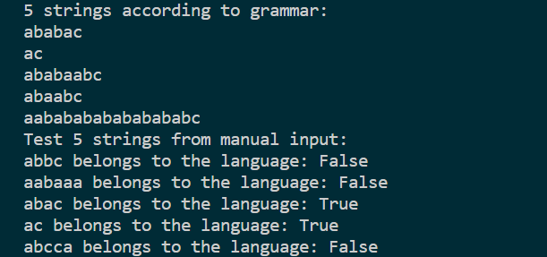

# Laboratory 1 Report

## Theory

- String: In computer science and mathematics, a string is a sequence of characters, which can include letters, numbers, punctuation marks, and other symbols. Strings are often used to represent words, sentences, or other data in a way that a computer can process.

- Alphabet: An alphabet is a set of symbols or characters that can be used to create strings. In computer science, an alphabet is usually a finite set of characters or symbols, such as the set {0, 1} used in binary arithmetic.

- Language: In computer science, a language is a set of strings that are formed from an alphabet. For example, the English language can be considered a set of strings that are formed from the English alphabet.

- Grammar: A grammar is a set of rules for generating strings in a language. In computer science, grammars are often used to describe the syntax of programming languages or other formal languages. A grammar consists of a set of production rules that specify how to form valid strings in the language.

- Finite state automaton: A finite state automaton (FSA) is a mathematical model of computation that can be used to recognize or generate strings in a language. An FSA consists of a finite number of states, which can transition between each other based on input symbols. FSAs are often used in computer science to model simple algorithms or to recognize patterns in input data.

## Objectives

1. Understand what a language is and what it needs to have in order to be considered a formal one.

2. Provide the initial setup for the evolving project that you will work on during this semester. I said project because usually at lab works, I encourage/impose students to treat all the labs like stages of development of a whole project. Basically you need to do the following:

a. Create a local && remote repository of a VCS hosting service (let us all use Github to avoid unnecessary headaches);

b. Choose a programming language, and my suggestion would be to choose one that supports all the main paradigms;

c. Create a separate folder where you will be keeping the report. This semester I wish I won't see reports alongside source code files, fingers crossed;

3. According to your variant number (by universal convention it is register ID), get the grammar definition and do the following tasks:

a. Implement a type/class for your grammar;

b. Add one function that would generate 5 valid strings from the language expressed by your given grammar;

c. Implement some functionality that would convert and object of type Grammar to one of type Finite Automaton;

d. For the Finite Automaton, please add a method that checks if an input string can be obtained via the state transition from it;

## Implementation

The `FiniteAutomaton` class responds for implementing the Finite Automata. Basically, we have a constructor where we assign values for the attributes:

- Q - a set of states
- Sigma - a set of input symbols
- delta - a transition function that maps a state and an input symbol to a new state
- q0 - the initial state
- F - a set of accepting states

The `string_belongs_to_language` method takes an input string and returns a boolean value indicating whether the input string is recognized by the FSA. It does this by iterating through each symbol in the input string and checking if it is in the FSA's input alphabet (Sigma). If it is, the transition function is applied to the current state and the symbol to obtain the next state. If the next state is an accepting state, the isAcceptingState flag is set to True. If the next state is not an accepting state or is not a valid state in the FSA (Q), the isAcceptingState flag is set to False. If the symbol is not in the input alphabet or the transition function cannot be applied to the current state and the symbol, the method returns False. Finally, the method returns the value of the isAcceptingState flag.

The Gramar class has 2 methods and the constructor. The constructor is used to instantiate 4 attributes:

- Vn - A set of non-terminal symbols in the grammar.
- Vt - A set of terminal symbols in the grammar.
- P - A dictionary that represents the production rules of the grammar. The keys of the dictionary are the non-terminal symbols, and the values are sets of strings that represent the possible productions for each non-terminal symbol.
- S - The start symbol of the grammar.

The `generate_string` method is used to generate a random string that belongs to the language defined by the grammar. The method implements a depth-first search algorithm that follows the production rules of the grammar.

The `dfs` function is a recursive helper function that takes a non-terminal symbol and generates a string by randomly selecting one of the possible productions for that non-terminal symbol. The function continues to apply the production rules to non-terminal symbols until only terminal symbols are left in the string.

The `generate_string` method calls the `dfs` function with the start symbol of the grammar to generate a random string that belongs to the language defined by the grammar.

The `to_finite_automaton` method converts the grammar to an equivalent finite-state automaton. The resulting automaton recognizes the same language as the grammar.

The method creates a set of states for the automaton that includes all non-terminal symbols in the grammar and some additional states. The set of terminal symbols in the grammar becomes the input alphabet of the automaton.

## Grammar

Variant 30:

VN={S, B, C, D},

VT={a, b, c},

P={

S → aB  
 B → bS  
 B → aC  
 B → c  
 C → bD  
 D → c  
 D → aC
}

This grammar is of type 2 according to Chomsky classification, because all the production rules have a single non-terminal value on the left, and can generate any combination of terminal/non-terminal symbols on the right.

## Conclusion

In this laboratory we implemented the concepts of Finite State Automaton Type-2 Grammar, using a grammar class to generate a set of strings, and the FSM class to determine whether a given set of strings belong to the language of the grammar.

The program gives the following output:

Finite state machines play a crucial role in both computer science and engineering, as they enable the modeling and analysis of systems with a limited number of states and transitions between them. These machines form an essential building block for a diverse range of practical applications, spanning from digital circuits to natural language processing.

Final State Machines provide a simple yet potent approach, which is extensively utilized in computer science and engineering. They are intuitive to grasp, implement, and emulate, and can model a vast range of real-world issues. Acquiring an understanding of FSMs is of great importance for students of computer science or engineering, as it offers a foundation for comprehending numerous other topics within these fields.
