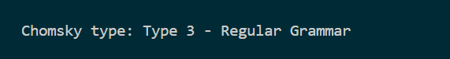

# Laboratory 2 Report

### Course: Formal Languages & Finite Automata

### Author: Zlatovcen Bogdan

## Theory

The main concepts used in that laboratory work are:

- Grammar: A grammar is a set of rules for generating strings in a language. In computer science, grammars are often used to describe the syntax of programming languages or other formal languages. A grammar consists of a set of production rules that specify how to form valid strings in the language.

- Finite state automaton: A finite state automaton (FSA) is a mathematical model of computation that can be used to recognize or generate strings in a language. An FSA consists of a finite number of states, which can transition between each other based on input symbols.

- Non-Deterministic Finite Automaton: NFA is a type of FSA where multiple transitions can be made from a single state on the same input symbol.

- Deterministic Finite Automaton: DFA is a type of FSA where there is only one transition from each state on a given distinct input symbol.

<ul> 
<li>Chomsky Classification: Chomsky hierarchy is a way of classifying formal languages based on the type of grammar that generates them. The hierarchy consists of four levels:</li>
<ul>
<li>Type 0: Unrestricted grammars</li>
<li>Type 1: Context-sensitive grammars</li>
<li>Type 2: Context-free grammars</li>
<li>Type 3: Regular grammars</li>
</ul>
</ul>

## Objectives

1. Understand what an automaton is and what it can be used for.

2. Continuing the work in the same repository and the same project, the following need to be added:
   a. Provide a function in your grammar type/class that could classify the grammar based on Chomsky hierarchy.

   b. For this you can use the variant from the previous lab.

3. According to your variant number (30), get the finite automaton definition and do the following tasks:

   a. Implement conversion of a finite automaton to a regular grammar.

   b. Determine whether your FA is deterministic or non-deterministic.

   c. Implement some functionality that would convert an NDFA to a DFA.

## Implementation

### Function to classify the grammar

The implementation for this task is provided by the `grammar_type` method of the `Grammar class`:

```
def grammar_type(self):
        if all(
            len(rhs) <= 1 and (rhs[0] in self.Vt)
            for prod in self.P.values()
            for rhs in prod
        ):
            return "Type 3 - Regular Grammar"
        elif all(
            len(rhs) >= 1 and (rhs[0] in self.Vt) and all(c in self.Vn for c in rhs[1:])
            for prod in self.P.values()
            for rhs in prod
        ):
            return "Type 2 - Context-Free Grammar"
        elif all(
            len(prod) > 0
            and all(rhs in self.Vn for rhs in prod[1:])
            and (prod[0] in self.Vn and all(len(rhs) > 0 and rhs[0] in self.Vt for rhs in prod[1:])

            )
            for prod in self.P.values()
        ):
            return "Type 1 - Context-Sensitive Grammar"
        else:
            return "Type 0 - Unrestricted Grammar"
```

The condition for Type 3 is that all the right-hand sides (rhs) for all the productions have at most one symbol and that the symbol is a terminal (Vt) symbol, or it has two symbols - a terminal followed by a non-terminal:

```
all(len(rhs) == 1 and (rhs[0] in self.Vt) or (len(rhs) == 2 and rhs[0] in self.Vt and rhs[1] in self.Vn) for prod in self.P.values() for rhs in prod)
```

The condition for Type 2 is that the left part contains only a nontermianl symbol:

```
all(len(lhs) == 1 and lhs[0] in self.Vn for lhs, prod in self.P.items()):
```

The condition for Type 1 is that the right-hand side of a production rule can have any combination of terminal and non-terminal symbols, with the constraint that the length of the right-hand side must be greater than or equal to the length of the left-hand side:

```
len(prod) > 0 and len(rhs) > 0 for prod in self.P.values() for rhs in prod
```

I tested for grammar from previos laboratory (Variant 30), and it gave a correct output of grammar of type 3:



### Function to transform Finite Automata into Regular Grammar:

The implementation is provided by the code:

```
def finite_automaton_to_grammar(self, automaton):
    Q = automaton.Q
    Sigma = automaton.Sigma
    delta = automaton.delta_reversed
    q0 = automaton.q0
    Vn = set(Q)
    P = {}
    for non_terminal in Q:
        production_rules = set()
        for key in delta[non_terminal]:
            value = delta[non_terminal][key]
            production_rules.add(value + key)
        P[non_terminal] = production_rules
    self.Vn = Vn
    self.Vt = Sigma
    self.P = P
    self.S = q0
```

Notice that I used `automaton.delta_reversed`, because for delta I used dictionaries. The problem is that for NFA I would have multiple keys with similar values, which is forbidden. That is why, in delta_reversed, I inverted values with keys, because in my case for variant 30, there are no repetitive states when transition from one state to another.
For Vn, Vt and S we just take the Q, Sigma and q0 from the automaton. For P we construct it as a dictionary, where the keys represent the left side, and the values are sets which represent the right side of a transition (Example of transition: q2 -> aq2, where q2 is left side of equation, and aq2 the right side).
The function is then caled in the main class, specifically for the NFA from my variant:

```
Q = {"q0", "q1", "q2"}
Sigma = {"a", "b", "c"}
q0 = "q0"
F = {"q2"}
delta = {
    "q0": {"a": "q0", "a": "q1"},
    "q1": {"c": "q1", "b": "q2", "a": "q0"},
    "q2": {"a": "q2"},
    }
delta_reversed = {
    "q0": {"q0": "a", "q1": "a"},
    "q1": {"q1": "c", "q2": "b", "q0": "a"},
    "q2": {"q2": "a"},
    }
fa = FiniteAutomaton(Q, Sigma, delta, delta_reversed, q0, F)
grammar.finite_automaton_to_grammar(fa)
```

The production rules we obtain are:

```
q0 -> aq1 | aq0
q1 -> cq1 | bq2 | aq0
q2 -> aq2 | epsilon
```

I did not specify the epsilon in the implementation, because we have the final automaton with F - set of final states, and we will check strings using the automaton.
Here is an example of checking 5 strings, and also the output shows the regular grammar representation for the given NFA:


### Function to identify if it is deterministic or non-deterministic automaton:

The implementation is provided by the method:

```
def is_dfa(self):
    for non_terminal in self.dela_reversed:
        distinct_values = set()
        for key in self.delta_reverse[non_terminal]:
            if self.delta_reversed[non_terminal[key] in distinct_values:
                return False
            else:
                distinct_values.add(selfdelta_reversed[non_terminal[key])
    return True
```

Basically, all we do is to check for multiple transition from a state on a distinct input. If a distinct input symbol is used for more than one transition from a state, we return False.

Because, for my variant it is given an NFA, I have the following output:


### Convertion of given NFA to a DFA:

The NFA given for my variant (Variant 30) is:
Q = {q0,q1,q2},
∑ = {a,b,c},
F = {q2},
δ(q0,a) = q1,
δ(q1,c) = q1,
δ(q1,b) = q2,
δ(q2,a) = q2,
δ(q0,a) = q0,
δ(q1,a) = q0.
The transition table for given NFA is:
| | a | b | c |
|--| --- | --- | --- |
|q0|{q0q1}|x|x|
|q1|q0|q2|q1|
|q2|q2|x|x|

The graph for this NFA is:


The best method for this particular case, in my opinion, is the Subset Construction Method. Applying it we obtain the transition table for DFA:
| | a | b | c |
|--| --- | --- | --- |
|q0|{q0q1}|x|x|
|{q0q1}|{q0q1}|q2|q1|
|q1|q0|q2|q1|
|q2|q2|x|x|

Using this method, we obtain this graph for the DFA:


I made the corresponding changes in the `to_dfa` method in the `FiniteAutomaton` class

Calling the `is_dfa` function now returns TRUE:


Notice that in the screenshot, q3 represents the state {q0q1}

## Conclusion

In this laboratory we implemented some fundamental tasks for study of formal languages, including NFA to DFA conversion.

The task of classifying grammar according to Chomsky Types helped me to finally understand the Chomsky hierarchy, and to conclude the mistakes done at previous laboratory work and seminars.
Furthermore, the laboratory work helped me to compare NFA and DFA, and the conclusion I came to is that NFA is less restrictive, but the non-determinism makes it harder to operate with, and an example was that it was hard to represent it using dictionaries, because key must be distinct. Each NFA can be converted to a DFA, and for that purpose there exists a lot of algorithms. The one I used during this laboratory work was the Subset Construction Method.

Overall, understanding NFA, DFA, and Chomsky classification is crucial in the field of computer science and is essential in the design and analysis of programming languages, compilers, and other software systems.

## References

dreampuf.github.io/GraphvizOnline/
https://www.youtube.com/watch?v=i-fk9o46oVY
https://www.tutorialspoint.com/automata_theory/chomsky_classification_of_grammars.html
